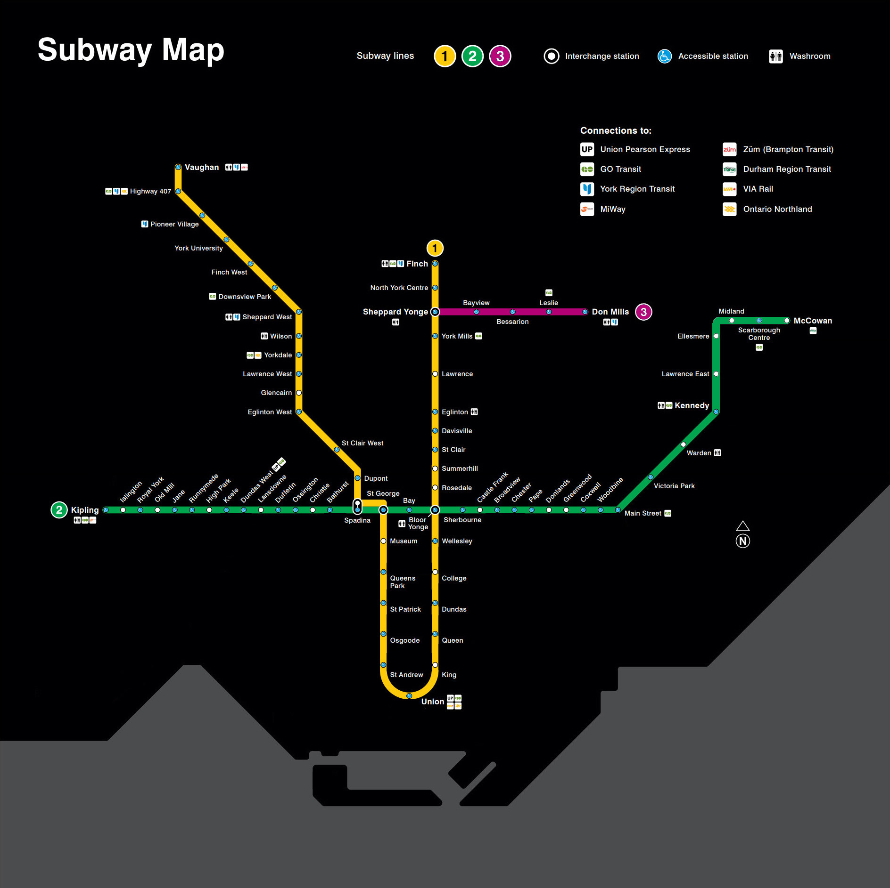

## subway-router

### This program simulates a router through subway stations

***Description:***

This program reads the JSON file and generates the corresponding subway scheme 
with stations, lines, and connections. After that, a router is created that calculates the shortest path 
from station A to station B, displays a list of all subway stations on the route, and calculates the average travel time.

***How to use:***

First, open the .jpg file with the image of the "SubwayMap", which lies in the root folder,
and familiarize yourself with map.
Create the "Main" class run configuration in your IDE and start the program.
The program will ask you to enter the name of the subway station of departure, 
select any station you like, and enter its name. Then the program will ask you to enter 
the destination station's name, enter any station. The router will display the route 
and the time required to travel. Please note that when entering the name of the station, 
the input case is not taken into account, but the correctness of the station name is taken into account.

***Tools used:***

Java  
Maven  
Json-Simple  

